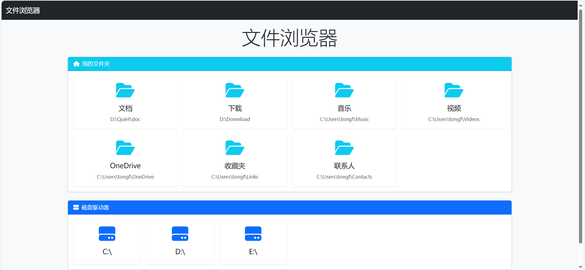

# 局域网在线浏览器项目
## 项目简介
基于Python Flask和JavaScript开发的局域网文件浏览器，支持文件管理、多媒体预览和多设备访问。

## 主要功能
- 文件列表展示(单/双列布局)
- 图片/视频预览(自动缩略图)
- 响应式设计(PC/移动端)
- 前后端分离架构
## 快速开始
1. 安装依赖：
   pip install -r requirements.txt
   npm install
2. 启动服务：
    运行 run.bat
    或
        python app/app.py
        npm start
3. 访问地址： http://localhost:5000

## 文档参考
- API接口文档
- 项目设计文档
- 前端后端分离说明

## 贡献指南
欢迎通过Issues或Pull Request参与贡献

## 许可证
MIT License

## 项目截图
